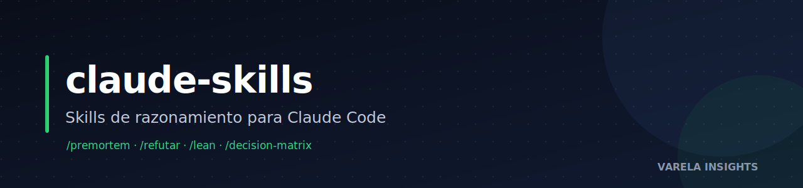

<p align="center"></p>
<p align="center">  [](https://www.varelainsights.com/)</p>

# claude-skills-public

Skills de razonamiento para **Claude Code** (CLI de Anthropic) — metodologías reutilizables basadas en frameworks públicos (Lean, falsación Popperiana, ISO/IEC 42001, Pareto, CPMAI).

Versión pública y sanitizada del conjunto de skills de razonamiento. Sin credenciales, sin datos de clientes, sin infraestructura interna — solo la metodología, lista para que cualquier persona o equipo la use.

---

## Skills incluidos

| Skill | Para qué sirve | Base |
|-------|----------------|------|
| `premortem` | Fracaso prospectivo ANTES de build/ship/deploy — imagina cómo falla antes de que falle | Premortem (Gary Klein) |
| `refutar` | Falsación popperiana operacional — mata un claim/cifra antes de construir encima | Karl Popper |
| `lean` | Elimina muda (desperdicio) en vibecoding + infra: previene acumulación y barre lo acumulado | Lean / TPS (Ohno), Poppendieck |
| `decision-matrix` | Matriz multicriterio ponderada para elegir entre opciones | Análisis de decisión |
| `clarifica-una-a-una` | Clarifica requisitos con preguntas de opción múltiple UNA A LA VEZ | UX conversacional |
| `document-progress` | Cierra y documenta una sesión de trabajo en una sola pasada | Bitácora + Trinity de manuales |
| `iso-42001-aims` | Playbook para aplicar ISO/IEC 42001:2023 (AI Management System) | ISO/IEC 42001:2023 |
| `orchestration-autonomy-tiers` | Asigna nivel de autonomía T0/T1/T2 a cada tarea según riesgo | ISO 42001 A.6 + CPMAI |
| `anti-hype-acronyms-guard` | Gate pre-entrega: caza acrónimos sin métricas y claims sin evidencia en PDFs/propuestas | Mueller alert |
| `prompt-rewrite` | Reescritura disciplinada de system prompts en producción que fallan | Ingeniería de prompts |

---

## Instalación

```bash
git clone https://github.com/varelaia/claude-skills-public.git ~/claude-skills-public
cd ~/claude-skills-public && ./install.sh
```

Esto copia todos los skills a `~/.claude/skills/`. Para instalar solo algunos:

```bash
./install.sh premortem refutar lean
```

Reinicia Claude Code y los skills estarán disponibles como `/premortem`, `/refutar`, etc.

---

## Filosofía

> **Los skills son playbooks que los agentes usan como referencia.** La mayoría no se invoca directo — se leen dentro de sesiones de agentes para dar doctrina y estructura.

Principios:
- **De-risk primero.** Ataca el supuesto que puede matar la operación.
- **Gates cableados > disciplina.** Lo opt-in se omite bajo presión de entrega.
- **Falsabilidad.** Toda métrica se mide antes/después con el mismo comando.
- **Progressive disclosure.** Descripción corta + cuerpo conciso + detalle pesado bajo demanda.

---

## Sanitización

Esta es una versión **sanitizada** de un conjunto privado más grande (~80 skills). El proceso de sanitización:

1. Selecciona solo skills de razonamiento basados en **frameworks públicos** (excluye metodología propietaria de agencia).
2. Elimina: credenciales, tokens, IPs, dominios internos, datos de clientes, paths internos.
3. Generaliza: nombres propios de usuarios, infraestructura, herramientas internas, sesiones internas.
4. Preserva: la metodología, las citas académicas, las tablas de comandos técnicos, los ejemplos genéricos.

Cada skill debe ser comprensible y útil sin conocimiento de su origen.

---

## Licencia

MIT — ver [`LICENSE`](LICENSE). Úsalo, adáptalo, compártelo.

## Créditos

Compilado y mantenido por **Irving Varela** ([@varelaia](https://github.com/varelaia)). Doctrina CPMAI + Premortem Gates.
